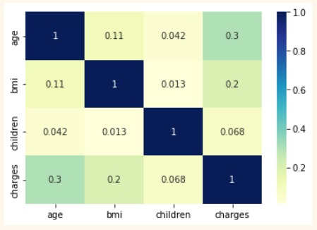
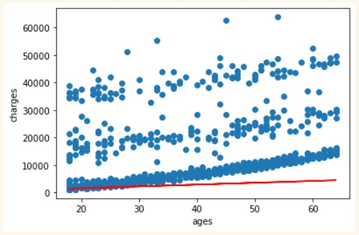

# Machine_Learning_Kuis_01

Heatmap

Graph

Hasil dan Kesimpulan

Pada kasus Medical Insurance Costs dapat disimpulkan bahwa variabel independen yang dapat digunakan dengan baik untuk menghasilkan model regresi adalah variabel ages.
